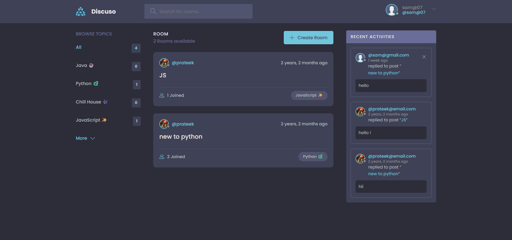
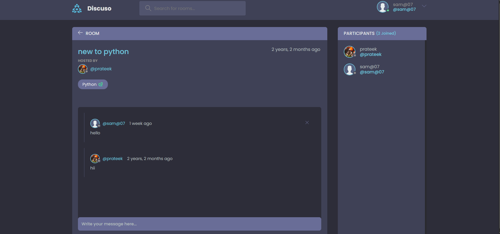
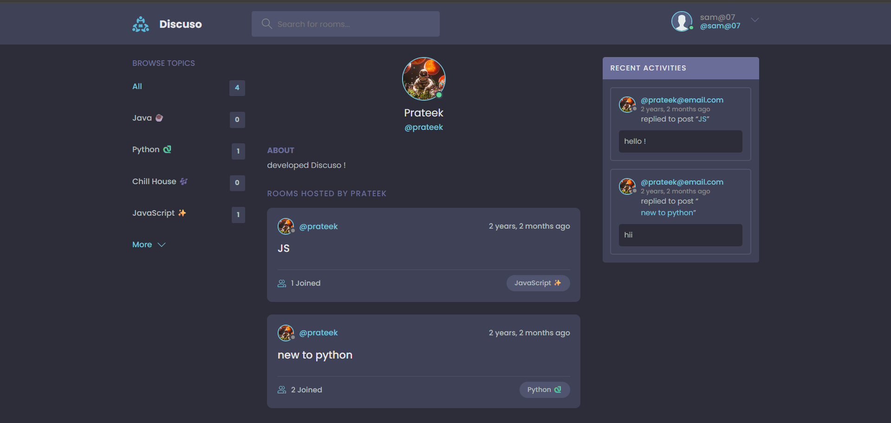

# Discuso - Interactive Discussion Platform

Discuso is a dynamic discussion platform built with Django that enables users to create, join, and participate in topic-based discussion rooms. The platform features real-time messaging, user authentication, and a clean, responsive interface.

## User Interface

### 1. Home Page


**Key Features:**
- Browse trending topics on the left sidebar
- View recent activities and discussions
- Quick access to all discussion rooms
- Real-time updates of recent activities
- Topic-wise filtering of discussions
- Dark mode UI for better readability

### 2. Discussion Room


**Key Features:**
- Real-time messaging interface
- Participant list on the right sidebar
- Message history with timestamps
- User avatars and names displayed
- Clean and intuitive chat layout
- Easy message input system

### 3. Profile Management


**Key Features:**
- Customizable user avatar upload
- Edit personal information
- Update username and email
- Add personal bio
- Modern form interface
- Input validation and error handling

### 4. Create Discussion Room


**Key Features:**
- Simple room creation interface
- Topic selection/creation
- Room description editor
- Privacy settings options
- Clean and minimalist design
- Quick setup process

### 5. Room Browse Interface


**Key Features:**
- List of all available rooms
- Topic categorization
- Host information display
- Recent activity indicators
- Easy room navigation
- Join/Leave room options

## Features

- 🔐 Email-based user authentication
- 👤 Custom user profiles with avatars and bios
- 🏠 Create and join discussion rooms
- 📝 Real-time messaging within rooms
- 🏷️ Topic-based room organization
- 🎨 Clean and responsive UI
- 🔄 REST API support
- 📱 Mobile-friendly design

## Technology Stack

- **Backend:** Django 4.1
- **Database:** PostgreSQL
- **Static Files:** WhiteNoise
- **API:** Django REST Framework
- **Frontend:** HTML, CSS, JavaScript
- **Authentication:** Django's built-in auth system

## Local Setup

### Prerequisites

- Python 3.8 or higher
- pip (Python package manager)
- Git

### Installation Steps

1. **Clone the repository**
   ```bash
   git clone https://github.com/prateek-code-22/discuso.git
   cd discuso
   ```

2. **Create and activate virtual environment**
   ```bash
   # Windows
   python -m venv venv
   .\venv\Scripts\activate

   # Linux/MacOS
   python3 -m venv venv
   source venv/bin/activate
   ```

3. **Install dependencies**
   ```bash
   pip install -r requirements.txt
   ```

4. **Configure environment variables**
   - Create a `config.json` file in the root directory with:
   ```json
   {
       "SECRET_KEY": "your-secret-key"
   }
   ```

5. **Apply database migrations**
   ```bash
   python manage.py migrate
   ```

6. **Create a superuser (admin)**
   ```bash
   python manage.py createsuperuser
   ```

7. **Collect static files**
   ```bash
   python manage.py collectstatic
   ```

8. **Run the development server**
   ```bash
   python manage.py runserver
   ```

9. **Access the application**
   - Open your browser and navigate to `http://127.0.0.1:8000`
   - Admin interface is available at `http://127.0.0.1:8000/admin`

## Usage

1. Register an account or log in
2. Browse existing discussion rooms or create a new one
3. Join rooms and participate in discussions
4. Create topics and organize rooms
5. Customize your profile with avatar and bio

